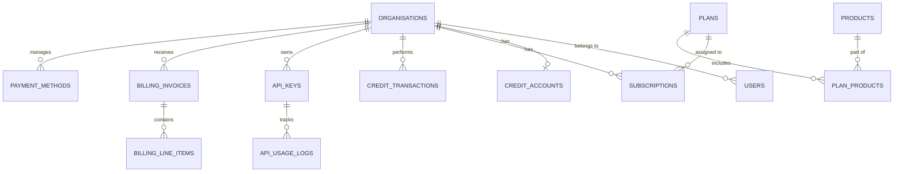

# Governance Intelligence — Database Schema

This document outlines the database schema for the Business Layer, derived from the existing migration structure and application services. The system uses **PostgreSQL** with UUIDs for primary keys.

## 1. Entity-Relationship Diagram

---

## 2. Core Management

### `organisations`
The root entity representing a company or client account.
- `id` (UUID): Primary key.
- `name` (VARCHAR): Display name.
- `slug` (VARCHAR): Unique URL-friendly identifier.
- `account_type` (VARCHAR): Defaults to `company`.
- `status` (VARCHAR): `active`, `suspended`.

### `users`
Identity management, linked to Keycloak.
- `id` (UUID): Primary key.
- `organisation_id` (UUID): FK to organisations.
- `keycloak_id` (VARCHAR): External ID from Keycloak.
- `email` (VARCHAR): Unique.
- `role` (VARCHAR): `admin`, `member`, `viewer`.

---

## 3. Product & Subscription System

### `products`
Individual GI services (e.g., Forensic Upload, OCR, Transcription).
- `slug` (VARCHAR): Unique (e.g., `forensic-upload`).
- `credit_cost` (NUMERIC): Cost per unit/usage.

### `plans`
Subscription bundles (e.g., Starter, Professional, Enterprise).
- `price_monthly` (NUMERIC): Base fee.
- `credits_monthly` (INTEGER): Included credit quota.
- `max_users` / `max_api_keys` (INTEGER): Entitlement limits.
- `features` (JSONB): List of enabled feature flags.

### `plan_products`
Many-to-many relationship linking plans to specific products.

### `subscriptions`
Active linkages between an organisation and a plan.
- `current_period_end` (TIMESTAMP): Expiry/Renewal date.
- `billing_cycle` (VARCHAR): `monthly`, `annual`.

---

## 4. Billing & Credits

### `credit_accounts`
Real-time balance tracking for an organisation.
- `balance` (NUMERIC): Current available credits.
- `reserved` (NUMERIC): Credits locked for pending jobs.

### `credit_transactions`
Ledger of all credit movements.
- `type` (VARCHAR): `credit` (top-up) or `debit` (usage).
- `ref_type` (VARCHAR): `payment`, `job`, `subscription`.

### `billing_invoices` & `billing_line_items`
Financial records for subscriptions and top-ups.

### `payment_methods` & `payment_transactions`
Integration with payment gateways (e.g., PayFast).

---

## 5. Developer & Infrastructure

### `api_keys`
Access credentials for programmatic usage.
- `key_hash` (VARCHAR): Hashed version of the key.
- `last_used_at` (TIMESTAMP).

### `api_usage_logs`
High-volume tracking of API requests for billing and auditing.

### `webhooks`
External notification endpoints for event-driven integrations.

### `audit_logs`
System-wide tracking of administrative changes (who did what).

### `job_reservations`
Temporary locks on credits while asynchronous processing occurs.
